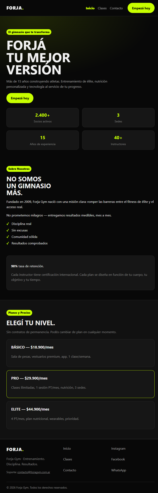
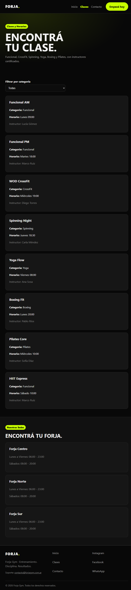
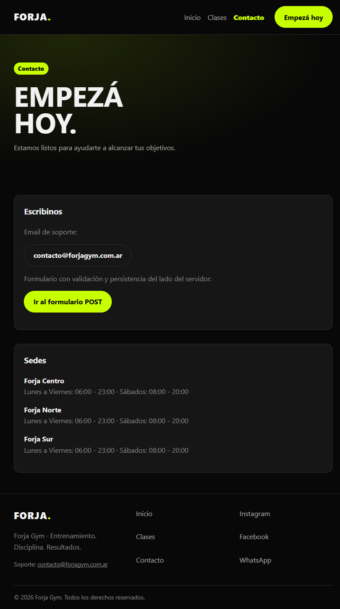
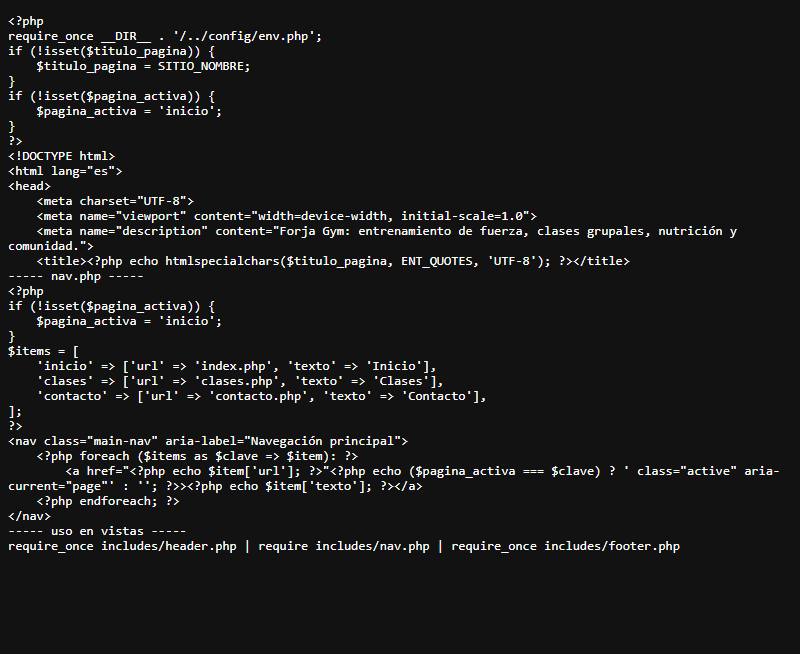
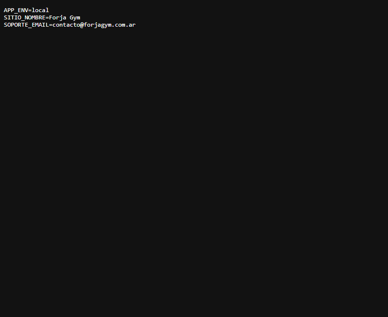
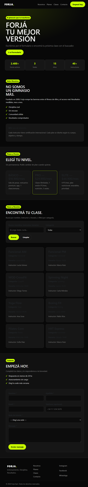
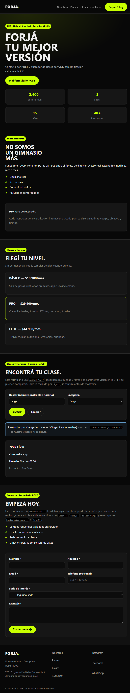
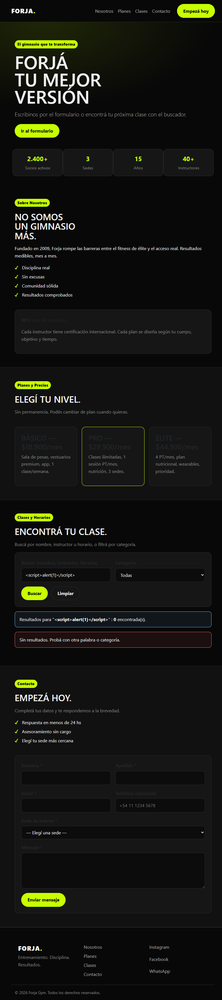
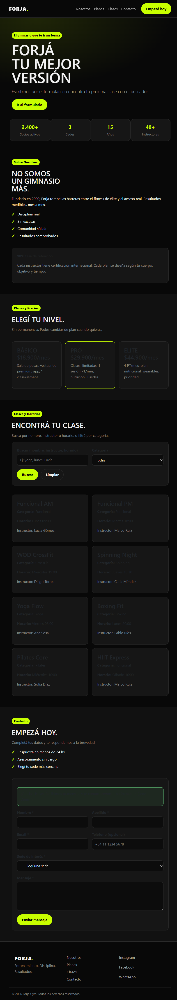
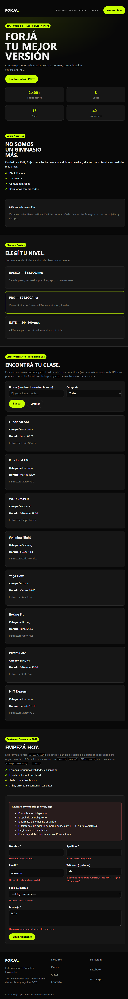

# TP N°3 - Sitio Web de un Gimnasio 🏋️

Acá está toda la documentación del proceso de diseño de un sitio web para un gimnasio: desde la elección del tema hasta el mapa del sitio.

## 1. Intereses personales

Entre mis intereses personales se destacan la actividad física y el entrenamiento de fuerza, que forman parte de mi rutina. También me interesa todo lo relacionado con la nutrición y los hábitos saludables, ya que entiendo que el ejercicio y la alimentación van de la mano a la hora de lograr resultados y bienestar. Por otro lado, me atrae la tecnología aplicada al deporte, como los wearables y las aplicaciones de seguimiento, que hoy permiten medir el rendimiento, controlar el progreso y tomar decisiones más informadas sobre el entrenamiento. Finalmente, valoro mucho la comunidad y la motivación grupal, porque considero que entrenar acompañado o formar parte de un grupo con objetivos similares ayuda a sostener la constancia en el tiempo.

## 2. Tema del sitio web

Elegí como tema el diseño de un sitio web para un gimnasio, ya que combina directamente varios de mis intereses personales: la actividad física, la tecnología aplicada al entrenamiento y la idea de comunidad. Me parece un tema interesante porque un sitio de este tipo no es solo una vidriera visual, sino que tiene que resolver necesidades concretas: mostrar planes y precios de forma clara, permitir reservar clases, comunicar los valores de la marca y transmitir motivación desde el primer segundo. Además, es un rubro con mucha competencia, lo que hace que la propuesta tenga que diferenciarse en diseño y experiencia de usuario para lograr que un visitante se convierta en socio. Esto me permite trabajar tanto el aspecto estético (fotografía, tipografía, colores que transmitan energía) como el funcional (usabilidad, proceso de inscripción, informacion clara), que es justamente lo que nos me interesa del diseño web.

## 3. Sitios web de referencia

| Sitio | Aspectos positivos | Aspectos negativos |
|---|---|---|
| **Smart Fit Argentina** (smartfit.com.ar) | Ubicador de sedes muy claro (mapa + buscador por barrio), planes con precios visibles, app propia integrada. Identidad de marca fuerte y consistente. CTA de "inscribite" repetido en cada sección. | Saturado de banners promocionales. Uso intensivo de cookies/pop-ups. Comparación entre planes no siempre clara. |
| **Gold's Gym** (goldsgym.com) | Imágenes de alto impacto que transmiten intensidad y comunidad. Historia de marca bien contada. Navegación simple. | No siempre muestra precios directo. Diseño genérico en sedes franquiciadas. Tiempos de carga lentos. |
| **Planet Fitness** (planetfitness.com) | Propuesta de valor muy clara ("Judgement Free Zone"). Alta de socio simplificada. Tono visual accesible. | Diseño algo plano/corporativo. Mucha repetición de CTAs de venta. Info de equipamiento en segundo plano. |
| **CrossFit** (crossfit.com) | Fuerte foco en comunidad, historias reales de atletas. Buscador de "boxes" muy funcional. Contenido educativo bien organizado. | Estética más cruda. Navegación confusa para nuevos usuarios. Precios no centralizados. |
| **Anytime Fitness** (anytimefitness.com) | Buscador de sede geolocalizado eficiente. Mensaje claro de "acceso 24hs". Testimonios reales en la home. | Diseño poco distintivo. Formularios de contacto largos. Versión mobile con jerarquía confusa. |

## 4. Wireframes a mano

Bocetos en papel de las secciones principales del sitio (header, hero, planes, clases, instructores, galería, nutrición, progreso/tecnología, comunidad, sedes, contacto, footer). Fotos disponibles en la carpeta `bocetos/`.

## 5. Mapa del sitio

```
Home
├── Nosotros
├── Planes y Precios
├── Clases
│   ├── Entrenamiento de Fuerza
│   ├── Funcional
│   └── Clases Grupales
├── Nutrición y Hábitos Saludables
├── Progreso y Tecnología
│   └── App / Wearables
├── Comunidad+
│   └── Testimonios
├── Sedes
│   └── Detalle de Sede
└── Contacto
```

## 6. Wireframe en Figma

https://www.figma.com/make/ra0LV4WcUW1xd2dN0y07hx/Wireframe-landing-page-gimnasio?t=Rgvp9jP1PosN34rL-20&fullscreen=1&preview-route=%2F%23contacto
---

---

---

---

---

---

---

---

---

---

---

---

---
## Estructura del repositorio

```
PW_GYM/
├── README.md
├── index.html
├── index.css
├── documentacion.md
├── bocetos/
│    └──Foto
├── figma/
│    └──Fotos
├── mapa_del_sitio/
├── css/
│    └──index.css
├── img/
├── js/
└── clase5/                  # TP5 - Formularios y Seguridad Web
     ├── index.php           # Front: procesa POST (contacto) + GET (buscador)
     ├── includes/
     │    ├── header.php     # SSI: <head> + header/nav (require)
     │    ├── footer.php     # SSI: footer + cierre (require)
     │    ├── functions.php  # Sanitización + validación anti-XSS
     │    └── data.php       # Datos de clases para el filtro GET
     ├── css/
     │    └── style.css      # Responsive (mobile-first)
     └── js/
          └── main.js        # Menú móvil
```

---

## Trabajo Práctico N° 4 — Migración a PHP, SSI y SSR (Unidad 4)

### Título y descripción

Forja Gym evoluciona del sitio estático (Hito 1, `index.html`) a una aplicación PHP con plantillas reutilizables. Se extrajeron `header`, `nav` y `footer` a `includes/`, se migraron las vistas a `index.php`, `clases.php` y `contacto.php` con `require`/`require_once`, se agregó título dinámico (`$titulo_pagina`), resaltado del menú activo (`$pagina_activa`) y configuración global por variables de entorno (`.env` + `config/env.php`).

### Enlace al prototipo de Figma

Ver enlace de Figma en la sección del TP N°3 de este README.

### Tecnologías utilizadas

HTML5, CSS3, JavaScript, PHP 8.x, servidor local (XAMPP/Laragon o `php -S`).

### Instalación y ejecución local

```bash
git clone https://github.com/IsaiasDc2/PW_GYM.git
cd PW_GYM
copy .env.example .env
php -S localhost:8000
# Abrir: http://localhost:8000/index.php
```

En XAMPP/Laragon: copiar el proyecto a `htdocs` (o `www`) y abrir `http://localhost/PW_GYM/index.php`.

### Evidencia de funcionamiento

| Evidencia | Captura |
|---|---|
| Servidor local corriendo (`http://localhost/...`) |  |
| Navegación con ítem activo (Clases) |  |
| Vista de contacto con email de entorno |  |
| Estructura modular SSI (`header.php`, `nav.php`, `footer.php`) |  |
| Variables de entorno (`.env.example`) |  |

Títulos dinámicos verificados por vista:

```
index.php    → <title>Inicio - Forja Gym</title>    (menú activo: Inicio)
clases.php   → <title>Clases - Forja Gym</title>    (menú activo: Clases)
contacto.php → <title>Contacto - Forja Gym</title>  (menú activo: Contacto)
```

El archivo `.env` está excluido en `.gitignore`; se versiona `.env.example` como plantilla. Rama de trabajo: `feature/migracion-php-ssi` integrada a `main` por Pull Request.

---

## Clase 5 — Procesamiento de Formularios y Seguridad Web (POST + GET)

Carpeta de entrega: `clase5/` — sitio modular en PHP con `include` / `require`.

### Cómo correrlo

```bash
# Requiere PHP 8+ (https://www.php.net/downloads)
cd PW_GYM
php -S localhost:8000 -t clase5
# Abrir: http://localhost:8000/index.php
```

### A. Formularios implementados

| Método | Ubicación | Campos | Uso |
|---|---|---|---|
| **POST** | `clase5/index.php#contacto` | Nombre*, Apellido*, Email*, Teléfono (opcional), Sede* (Centro/Norte/Sur), Mensaje* | Registro/contacto. Los datos viajan en el cuerpo de la petición. Se procesa con `$_POST` + `filter_input(INPUT_POST, ...)` |
| **GET** | `clase5/index.php#clases` | `q` (texto libre: nombre/instructor/horario), `cat` (Funcional/Spinning/CrossFit/Yoga/Boxing/Pilates/Todas) | Búsqueda/filtro de clases. Los parámetros viajan en la URL (ej: `index.php?q=yoga&cat=Yoga#clases`), se pueden compartir y marcar. Se procesa con `$_GET` + `filter_input(INPUT_GET, ...)` |

### B. Sanitización y validación (OWASP Top 10 — XSS)

Archivo: `clase5/includes/functions.php`

- **Nunca se muestra `$_POST` / `$_GET` sin sanitizar.** Toda salida pasa por `e()` = `htmlspecialchars($v, ENT_QUOTES, 'UTF-8')` (22 ecos asegurados, 0 directos — verificado con búsqueda de `echo $`).
- Entrada: `trim()` + `filter_input(..., FILTER_UNSAFE_RAW)` con fallback a `$_POST/$_GET` ya recortado.
- **Validación en servidor** (`validar_contacto()`):
  - Requeridos con `empty()` / `isset()`: nombre, apellido, email, sede, mensaje.
  - Email con `filter_var($email, FILTER_VALIDATE_EMAIL)`.
  - Nombre/apellido: 2–50 caracteres, solo letras/espacios/`'`/`-` (regex unicode).
  - Teléfono opcional: `/^[0-9+\-() ]{7,20}$/`.
  - Sede contra lista blanca `['Centro','Norte','Sur']`; categoría GET contra lista blanca (si llega otra cosa se ignora).
  - Mensaje: 10–1000 caracteres.
- **Prueba XSS:** escribir en el buscador o en cualquier campo `<script>alert(1)</script>` → se muestra como texto escapado (`&lt;script&gt;…`), no se ejecuta. Lo mismo en la URL: `index.php?q=%3Cscript%3Ealert(1)%3C%2Fscript%3E#clases`.

### C. Retroalimentación y persistencia

- **Éxito POST:** caja verde `¡Gracias, {nombre}! Recibimos tu mensaje y te contactaremos a {email} (sede {sede}).` (todo escapado).
- **Error POST:** caja roja con conteo + lista de errores, más mensaje bajo cada campo (`field-error`). Se conservan los valores con `value="<?php echo e(...); ?>"` y `selected` / contenido del `textarea` para no reescribir.
- **GET:** caja informativa con lo buscado (`Resultados para "yoga" en categoría Yoga: N encontrada(s)`) o `Sin resultados…`. El `input` y el `select` conservan `q` / `cat`.

### Capturas de pantalla

> Capturas tomadas con el servidor local `php -S 127.0.0.1:8000 -t clase5` (PHP 8.5 + mbstring). Archivos en `clase5/screenshots/`.

| Estado | Captura |
|---|---|
| Home + buscador GET |  |
| Resultado GET con filtro |  |
| Prueba XSS neutralizada (`<script>` escapado) |  |
| POST exitoso |  |
| POST con errores + persistencia |  |

Para tomarlas: abrir `http://localhost:8000/index.php`, probar (1) `q=yoga`, (2) `q=<script>alert(1)</script>`, (3) enviar contacto vacío y luego válido, y capturar con `Win + Shift + S` guardando en `clase5/screenshots/` con esos nombres.


